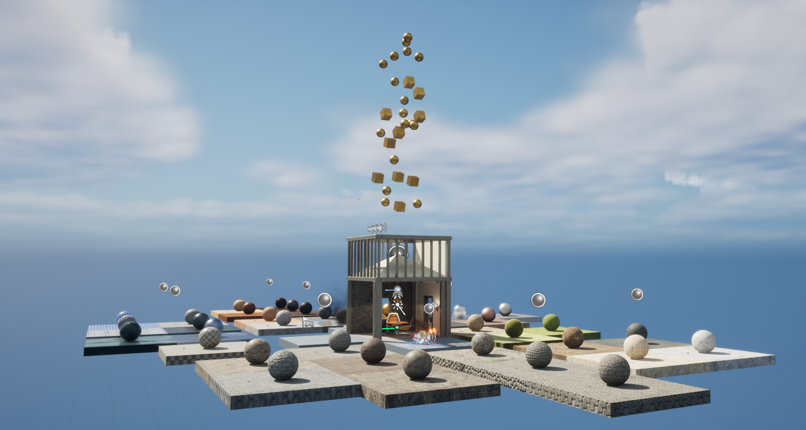
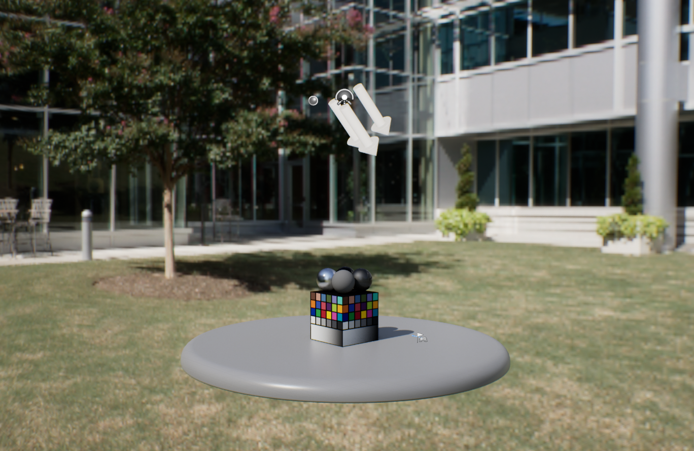

# Unreal Engine 5.6 Starter Content (Standalone Archive)

This repository provides the **Starter Content** from Unreal Engine 5.6 as a standalone downloadable archive (`.zip`).

## Overview

Starter Content is a collection of common assets provided by Unreal Engine, including:

- Materials
- Static Meshes
- Particle Effects
- Textures
- Example Maps

These assets are designed to help developers quickly prototype environments and gameplay without creating assets from scratch.

## Contents

```text
Content/
└── StarterContent/
    ├── Materials/
    ├── Meshes/
    ├── Particles/
    ├── Props/
    ├── Shapes/
    ├── Textures/
    └── Maps/
        ├── StarterMap
        └── Advanced_Lighting
```

## Included Maps

### StarterMap

The `StarterMap` Level, located in the `Content/StarterContent/Maps` folder, is a demo of the starter content in action. Press **Play** or **Simulate** in the Main Toolbar to see it in action.



### Advanced_Lighting

Starter content also includes the `Advanced_Lighting` Level, which demonstrates a lighting setup created using Blueprints.



## Download

Go to the Releases section and download:

- [UE5.6_StarterContent.zip](https://github.com/sungkukpark/ue5-starter-content-5.6/releases/download/5.6/UE5.6_StarterContent.zip)

## Usage

1. Extract the archive
2. Copy the StarterContent folder into your Unreal project:

    `<project_name>/Content/StarterContent`

3. Open Unreal Engine
4. Assets will appear in the Content Browser

## Notes

- This is a direct extraction of Unreal Engine Starter Content.
- No modifications have been made.
- Intended for convenience when the built-in Starter Content option is unavailable.

## License

This content is provided under the Unreal Engine EULA.
Refer to Epic Games licensing terms for usage and redistribution rights.

- [Unreal® Engine End User License Agreement](https://www.unrealengine.com/eula)
